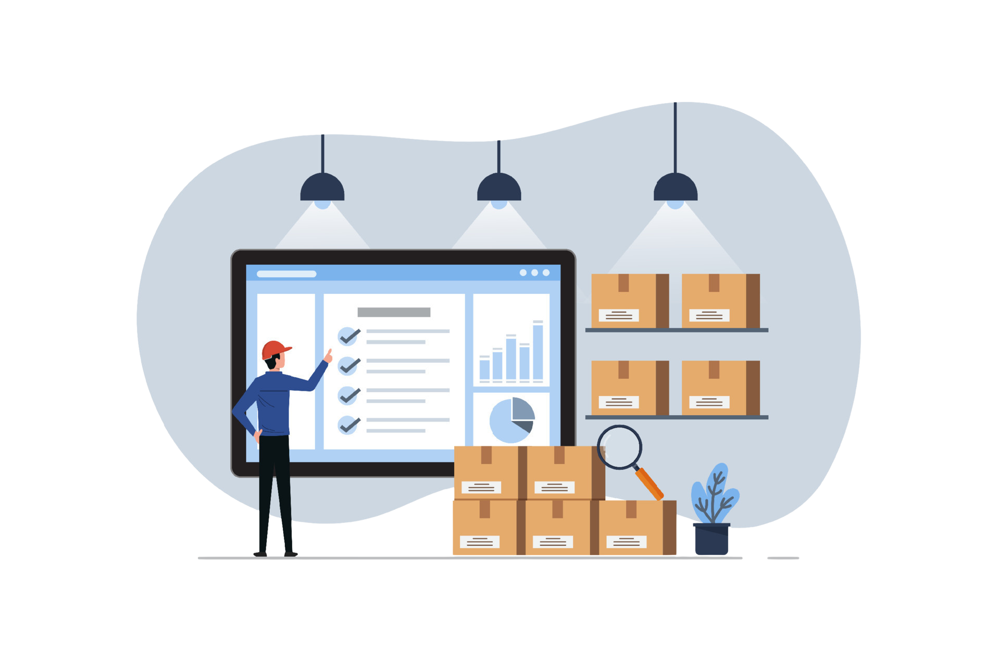

  
   
  STOCK MANAGEMENT APP

## Project Description

In the stock management project, which is a multi-page frontend web application, I worked on global state management using Redux and used the REST API in the Node.js backend structure.
It is an application where users can control stock, add, delete and edit companies, brands and products and view this information in a table.

##  Live Link of the Project
[LİVE](https://stock-app-zlhshn.vercel.app/)

## How does my project look

## Tech/framework used
📦 React.js  
📦 React-redux  
📦 Redux/Toolkit  
📦 React-Router-Dom  
📦 Redux-Persist  
📦 React-toastify  
📦 Yup -Formik  
📦 Axios  
📦 React-Tremor  
📦 Material UI  
📦 MUI DataGrid  
📦 Daisy UI  
📦 Tailwind CSS  
📦 CRUD Operation  
📦 REST API  
📦 POSTMAN  
📦 Redux DevTool  

## The structure followed in the project

- I created the project with the create-react-app.
- First, planned the page structure using react router.
- Carried out global state management in authentication processes using **Redux** and **Redux-toolkit** .
- Validation operations in the form structure were performed using **Formik** and **Yup** libraries.
- Created page contents after testing api requests using **Postman**.
- The contents were displayed as cards on the company and brand pages, and new information was added and edited using the modal structure.
- All **CRUD** operations were done by sending a request to the API
- Transactions made using **Axios** were also controlled by creating a custom hook in the global state.
- User information was stored using **React-persist**
- Tailwind and Material UI libraries were used for styled
- **React-tremor** library was used for graphic drawings on the dashboard page
- It was written by trying to pay attention to **DRY** principles.

## How to use?
⭐ This web application is created based on stock control management. 
⭐ Users can access the page after registering or logging in. 
⭐ In the application, product, purchase and sales tracking can be done. 
⭐ Firms and brands information can be added, deleted and edited. 
⭐ Total sales,total purchases  and profit can be displayed on the dashboard. 

## API Reference
  https://16150.fullstack.clarusway.com/

## To run the project
 install the dependencies:.  
 `yarn install` OR `npm install`.  
 Then start the application:.  
`yarn start` OR `npm start`.  
  
